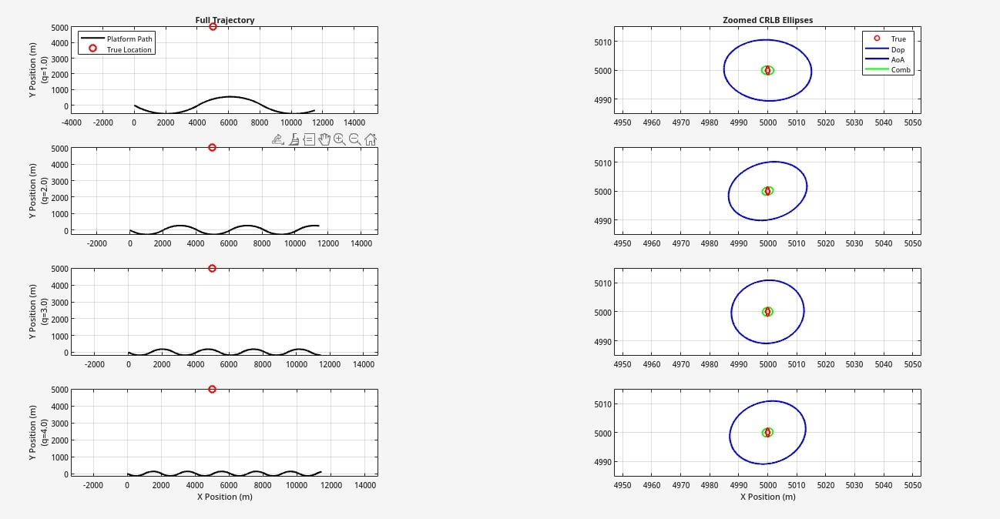
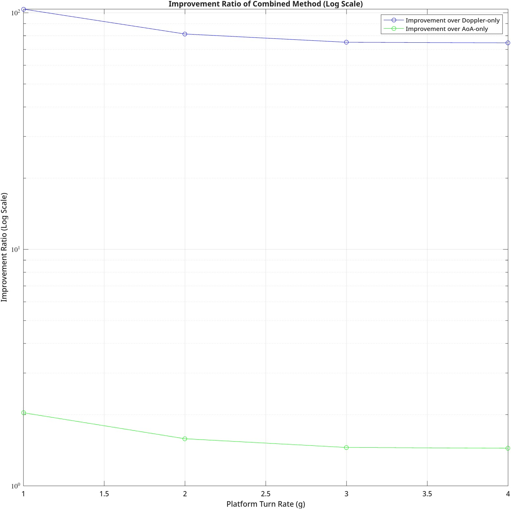

# Combined Doppler and AoA Emitter Location

MATLAB implementation and analysis of Combined Doppler and Angle-of-Arrival (AoA) methods for passive emitter localization.

## Mathematical Models

### Doppler Measurement Model

The Doppler frequency shift measurement model is given by:

$$f(t, \mathbf{x}) = f_c - \frac{f_c}{c} \frac{\mathbf{V}(t) \cdot (\mathbf{P}(t) - \mathbf{X})}{\|\mathbf{P}(t) - \mathbf{X}\|}$$

where:
- $\mathbf{x} = [X, Y, Z, f_c]^T$ is the parameter vector
- $f_c$ is the carrier frequency
- $\mathbf{P}(t) = [X_p(t), Y_p(t), Z_p(t)]^T$ is the platform position
- $\mathbf{V}(t) = [V_x(t), V_y(t), V_z(t)]^T$ is the platform velocity
- $\mathbf{X} = [X, Y, Z]^T$ is the emitter position
- $c$ is the speed of light

The observed Doppler measurements include additive noise:

$$\tilde{f}(t_i, \mathbf{x}) = f(t_i, \mathbf{x}) + \nu(t_i)$$

where $\nu(t_i) \sim \mathcal{N}(0, \sigma_f^2)$ is Gaussian noise.

### Angle-of-Arrival Measurement Model

The AoA phase measurement model is given by:

$$\phi(t_i) = \phi_0 - \frac{2\pi}{\lambda} \frac{\mathbf{L}(t_i) \cdot (\mathbf{P}(t_i) - \mathbf{X})}{\|\mathbf{P}(t_i) - \mathbf{X}\|}$$

where:
- $\phi_0$ is the phase offset
- $\lambda = \frac{c}{f_c}$ is the wavelength
- $\mathbf{L}(t_i)$ is the scaled baseline vector at time $t_i$

The noisy AoA measurements are modeled as:

$$\tilde{\phi}(t_i) = \phi(t_i) + w_\phi(t_i)$$

where $w_\phi(t_i) \sim \mathcal{N}(0, \sigma_\phi^2)$.

## Jacobian Matrices

### Doppler Jacobian

The Jacobian matrix for Doppler measurements consists of partial derivatives:

$$\mathbf{H}_{Dop} = \begin{bmatrix} \frac{\partial f}{\partial X} & \frac{\partial f}{\partial Y} & \frac{\partial f}{\partial Z} & \frac{\partial f}{\partial f_c} \end{bmatrix}$$

where:

$$\frac{\partial f}{\partial X} = \frac{f_c}{c} \left( \frac{V_x \cdot r - \text{Ratio} \cdot (X_p - X)}{r^3} \right)$$

$$\frac{\partial f}{\partial Y} = \frac{f_c}{c} \left( \frac{V_y \cdot r - \text{Ratio} \cdot (Y_p - Y)}{r^3} \right)$$

$$\frac{\partial f}{\partial Z} = \frac{f_c}{c} \left( \frac{V_z \cdot r - \text{Ratio} \cdot (Z_p - Z)}{r^3} \right)$$

$$\frac{\partial f}{\partial f_c} = 1 - \frac{1}{c} \cdot \text{Ratio}$$

with:
- $r = \|\mathbf{P} - \mathbf{X}\|$ is the range from platform to emitter
- $\text{Ratio} = \frac{\mathbf{V} \cdot (\mathbf{P} - \mathbf{X})}{r}$ is the projection of velocity onto the line-of-sight vector

### AoA Jacobian

The Jacobian matrix for AoA measurements is:

$$\mathbf{H}_{AoA} = \begin{bmatrix} \frac{\partial \phi}{\partial X} & \frac{\partial \phi}{\partial Y} & \frac{\partial \phi}{\partial Z} & \frac{\partial \phi}{\partial \phi_0} \end{bmatrix}$$

where:

$$\frac{\partial \phi}{\partial X} = \frac{2\pi}{\lambda} \left( \frac{L_x \cdot r - \text{Ratio}_{AoA} \cdot (X_p - X)}{r^3} \right)$$

$$\frac{\partial \phi}{\partial Y} = \frac{2\pi}{\lambda} \left( \frac{L_y \cdot r - \text{Ratio}_{AoA} \cdot (Y_p - Y)}{r^3} \right)$$

$$\frac{\partial \phi}{\partial Z} = \frac{2\pi}{\lambda} \left( \frac{L_z \cdot r - \text{Ratio}_{AoA} \cdot (Z_p - Z)}{r^3} \right)$$

$$\frac{\partial \phi}{\partial \phi_0} = 1$$

with:
- $\text{Ratio}_{AoA} = \frac{\mathbf{L} \cdot (\mathbf{P} - \mathbf{X})}{r}$ is the projection of baseline vector onto the line-of-sight

## Combined Nonlinear Least Squares Estimator

<!-- -->
The combined estimator minimizes the weighted sum of squared residuals:

$$\hat{\mathbf{x}} = \arg\min_{\mathbf{x}} \left[ (\tilde{\mathbf{f}} - \mathbf{f}(\mathbf{x}))^T \mathbf{C}_f^{-1} (\tilde{\mathbf{f}} - \mathbf{f}(\mathbf{x})) + (\tilde{\boldsymbol{\phi}} - \boldsymbol{\phi}(\mathbf{x}))^T \mathbf{C}_\phi^{-1} (\tilde{\boldsymbol{\phi}} - \boldsymbol{\phi}(\mathbf{x})) \right]$$

where:
- $\mathbf{C}_f = \sigma_f^2 \mathbf{I}$ is the Doppler measurement covariance matrix
- $\mathbf{C}_\phi = \sigma_\phi^2 \mathbf{I}$ is the AoA measurement covariance matrix

This is solved iteratively using the Gauss-Newton method:

$$\mathbf{x}_{k+1} = \mathbf{x}_k + \delta \mathbf{x}_k$$

where:

$$\delta \mathbf{x}_k = \left( \mathbf{H}_{combined}^T \mathbf{C}_{combined}^{-1} \mathbf{H}_{combined} + \lambda \mathbf{I} \right)^{-1} \mathbf{H}_{combined}^T \mathbf{C}_{combined}^{-1} \mathbf{r}_{combined}$$

with:
- $\mathbf{H}_{combined} = \begin{bmatrix} \mathbf{H}_{Dop} \\ \mathbf{H}_{AoA} \end{bmatrix}$ is the combined Jacobian matrix
- $\mathbf{C}_{combined} = \begin{bmatrix} \mathbf{C}_f & \mathbf{0} \\ \mathbf{0} & \mathbf{C}_\phi \end{bmatrix}$ is the block-diagonal combined covariance
- $\mathbf{r}_{combined} = \begin{bmatrix} \tilde{\mathbf{f}} - \mathbf{f}(\mathbf{x}_k) \\ \tilde{\boldsymbol{\phi}} - \boldsymbol{\phi}(\mathbf{x}_k) \end{bmatrix}$ is the residual vector
- $\lambda$ is the regularization parameter for numerical stability

## Cramer-Rao Lower Bound (CRLB) Analysis

The CRLB provides the theoretical lower bound on the covariance matrix of any unbiased estimator:

$$\mathbf{C}_{CRLB}(\mathbf{x}) = \mathbf{J}^{-1}$$

where $\mathbf{J}$ is the Fisher Information Matrix (FIM):

### Doppler-only FIM

$$\mathbf{J}_{Dop} = \frac{1}{\sigma_f^2} \mathbf{H}_{Dop}^T \mathbf{H}_{Dop}$$

### AoA-only FIM

$$\mathbf{J}_{AoA} = \frac{1}{\sigma_\phi^2} \mathbf{H}_{AoA}^T \mathbf{H}_{AoA}$$

### Combined FIM

$$\mathbf{J}_{combined} = \mathbf{H}_{combined}^T \mathbf{C}_{combined}^{-1} \mathbf{H}_{combined}$$

The CRLB trace is used as a scalar measure of estimation uncertainty:

$$\text{CRLB}_{\text{trace}} = \text{trace}(\mathbf{C}_{CRLB}(\mathbf{x}))$$

## Platform Trajectory Model

The platform trajectory is generated using the weave model, which provides position and velocity as functions of time. The motion is characterized by alternating turns with specified g-force.

The turn angle is modeled as:

$$\theta(t) = \theta_{max} \cdot \sin\left(\frac{v_{horiz} \cdot t}{r_{turn}}\right)$$

where:
- $\theta_{max}$ is the maximum turn angle (30 degrees)
- $v_{horiz}$ is the horizontal velocity
- $r_{turn} = \frac{v_{horiz}^2}{a_{horiz}}$ is the turn radius
- $a_{horiz} = g \cdot 9.81$ m/s² is the horizontal acceleration

The platform velocities are computed as:

$$v_x = v_{horiz} \cdot \cos(\theta(t))$$
$$v_y = -v_{horiz} \cdot \sin(\theta(t))$$
$$v_z = v_z + a_z \cdot \Delta t$$

where $a_z$ alternates between positive and negative values to create vertical oscillation.

## Monte Carlo Simulation

The Monte Carlo simulation generates multiple realizations of noisy measurements and applies the estimator to each:

$$\tilde{f}_i(t_j) = f(t_j, \mathbf{x}) + \nu_i(t_j), \quad \nu_i(t_j) \sim \mathcal{N}(0, \sigma_f^2)$$
$$\tilde{\phi}_i(t_j) = \phi(t_j, \mathbf{x}) + w_{\phi,i}(t_j), \quad w_{\phi,i}(t_j) \sim \mathcal{N}(0, \sigma_\phi^2)$$

The RMS error is calculated as:

$$\text{RMS}_x = \sqrt{\frac{1}{N_{MC}} \sum_{i=1}^{N_{MC}} (X_i - X_{true})^2}$$
$$\text{RMS}_y = \sqrt{\frac{1}{N_{MC}} \sum_{i=1}^{N_{MC}} (Y_i - Y_{true})^2}$$
$$\text{RMS}_z = \sqrt{\frac{1}{N_{MC}} \sum_{i=1}^{N_{MC}} (Z_i - Z_{true})^2}$$
$$\text{RMS}_{3D} = \sqrt{\text{RMS}_x^2 + \text{RMS}_y^2 + \text{RMS}_z^2}$$

## Improvement Ratio Calculation

The improvement ratio of the combined method over Doppler-only is:

$$R_{Dop} = \frac{\text{trace}(\mathbf{C}_{CRLB,Dop})}{\text{trace}(\mathbf{C}_{CRLB,combined})}$$

The improvement ratio over AoA-only is:

$$R_{AoA} = \frac{\text{trace}(\mathbf{C}_{CRLB,AoA})}{\text{trace}(\mathbf{C}_{CRLB,combined})}$$

## Results

### Emitter Location Estimation

### Error Analysis

### Method Comparison

### Trajectory Analysis

### Measurement Quality Impact

## Key Findings

1. **Position Estimation Accuracy**:
   - Doppler-only: 3D RMS error = 9.17m
   - AoA-only: 3D RMS error = 2.55m
   - Combined: 3D RMS error = 2.30m

2. **CRLB Analysis**:
   - Doppler-only: $\text{trace}(\mathbf{C}_{CRLB,Dop}) = 8.47 \times 10^1$
   - AoA-only: $\text{trace}(\mathbf{C}_{CRLB,AoA}) = 1.64 \times 10^0$
   - Combined: $\text{trace}(\mathbf{C}_{CRLB,combined}) = 1.13 \times 10^0$

3. **Improvement Ratios**:
   - Over Doppler-only: $R_{Dop} = 75.05$
   - Over AoA-only: $R_{AoA} = 1.45$

4. **Trajectory Impact**:
   - 1.0g: $R_{Dop} = 103.64$, $R_{AoA} = 2.04$
   - 2.0g: $R_{Dop} = 81.36$, $R_{AoA} = 1.58$
   - 3.0g: $R_{Dop} = 75.05$, $R_{AoA} = 1.45$
   - 4.0g: $R_{Dop} = 74.63$, $R_{AoA} = 1.44$

5. **Measurement Quality Impact**:
   - Optimal improvement (2.46×) occurs at $\sigma_f = 3.16$ Hz, $\sigma_\phi = 10.00$ degrees
   - Improvement ratio varies systematically with measurement quality, following a pattern where the combined method provides greatest advantage when compensating for poor quality in one measurement type

## References

[1] N. O'Donoughue, Emitter Detection and Geolocation for Electronic Warfare, ser. Artech House electronic warfare library. Artech House, 2019. [Online]. Available: https://books.google.com/books?id=TbjEDwAAQBAJ

[2] S. Frattasi and F. Rosa, Mobile Positioning and Tracking: From Conventional to Cooperative Techniques, ser. IEEE Press. Wiley, 2017. [Online]. Available: https://books.google.com/books?id=rvImDwAAQBAJ

[3] R. G. Stansfield, "Statistical theory of d.f. fixing," Journal of the Institution of Electrical Engineers - Part IIIA: Radiocommunication, vol. 94, no. 15, pp. 762–770, April 1947.

[4] D. J. Torrieri, "Statistical theory of passive location systems," IEEE Transactions on Aerospace and Electronic Systems, vol. AES-20, pp. 183–198, 1984. [Online]. Available: https://api.semanticscholar.org/CorpusID:8983806

[5] K. Becker, "An efficient method of passive emitter location," IEEE Transactions on Aerospace Electronic Systems, vol. 28, no. 4, pp. 1091–1104, Oct. 1992.

[6] J. Foutz, A. Spanias, and M. Banavar, Narrowband Direction of Arrival Estimation for Antenna Arrays, 01 2008, vol. 3.

[7] M. Fowler, "Eece 522 estimation theory lecture notes," http://www.ws.binghamton.edu/fowler/fowler%20personal%20page/EE522.htm, Jan. 29 2014.

[8] M. Khalaf-Allah, "Emitter location with azimuth and elevation measurements using a single aerial platform for electronic support missions," Sensors, vol. 21, no. 12, 2021. [Online]. Available: https://www.mdpi.com/1424-8220/21/12/3946

[9] Fundamentals of Statistical Signal Processing, Volume 1: Estimation Theory. Pearson Education. [Online]. Available: https://books.google.com/books?id=pDnV5qf1f6IC

[10] E. J. Bailey, "Single platform geolocation of radio frequency emitters," Air Force Institute of Technology, 2015. [Online]. Available: https://scholar.afit.edu/etd/22

[11] M. Fowler, "Analysis of single-platform passive emitter location with terrain data," IEEE Transactions on Aerospace and Electronic Systems, vol. 37, no. 2, pp. 495–507, 2001.
