# Combined Doppler and AoA Emitter Location

MATLAB implementation and analysis of Combined Doppler and Angle-of-Arrival (AoA) methods for passive emitter localization.

## Mathematical Models

### Doppler Measurement Model

The Doppler frequency shift measurement model is given by:

where:
- $\mathbf{x} = [X, Y, Z, f_c]^T$ is the parameter vector
- $f_c$ is the carrier frequency
- $\mathbf{P}(t) = [X_p(t), Y_p(t), Z_p(t)]^T$ is the platform position
- $\mathbf{V}(t) = [V_x(t), V_y(t), V_z(t)]^T$ is the platform velocity
- $\mathbf{X} = [X, Y, Z]^T$ is the emitter position
- $c$ is the speed of light

The observed Doppler measurements include additive noise:

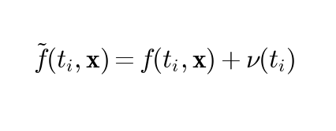

where $\nu(t_i) \sim \mathcal{N}(0, \sigma_f^2)$ is Gaussian noise.

### Angle-of-Arrival Measurement Model

The AoA phase measurement model is given by:

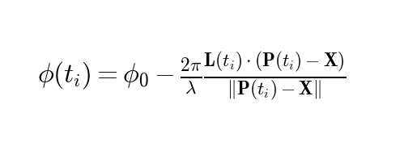

where:
- $\phi_0$ is the phase offset
- $\lambda = \frac{c}{f_c}$ is the wavelength
- $\mathbf{L}(t_i)$ is the scaled baseline vector at time $t_i$

The noisy AoA measurements are modeled as:

where $w_\phi(t_i) \sim \mathcal{N}(0, \sigma_\phi^2)$.

## Jacobian Matrices

### Doppler Jacobian

The Jacobian matrix for Doppler measurements consists of partial derivatives:

$$\mathbf{H}_{Dop} = \begin{bmatrix} \frac{\partial f}{\partial X} & \frac{\partial f}{\partial Y} & \frac{\partial f}{\partial Z} & \frac{\partial f}{\partial f_c} \end{bmatrix}$$

where:

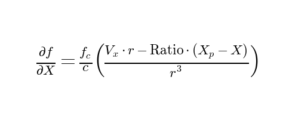

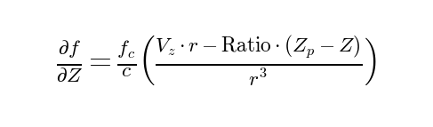

with:
- $r = \|\mathbf{P} - \mathbf{X}\|$ is the range from platform to emitter
- $\text{Ratio} = \frac{\mathbf{V} \cdot (\mathbf{P} - \mathbf{X})}{r}$ is the projection of velocity onto the line-of-sight vector

### AoA Jacobian

The Jacobian matrix for AoA measurements is:

$$\mathbf{H}_{AoA} = \begin{bmatrix} \frac{\partial \phi}{\partial X} & \frac{\partial \phi}{\partial Y} & \frac{\partial \phi}{\partial Z} & \frac{\partial \phi}{\partial \phi_0} \end{bmatrix}$$

where:

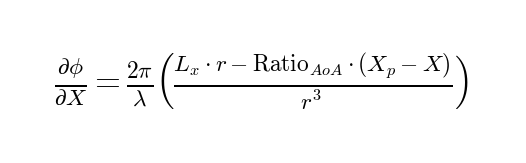

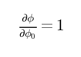

with:
- $\text{Ratio}_{AoA} = \frac{\mathbf{L} \cdot (\mathbf{P} - \mathbf{X})}{r}$ is the projection of baseline vector onto the line-of-sight

## Combined Nonlinear Least Squares Estimator

The combined estimator minimizes the weighted sum of squared residuals:

where:
- $\mathbf{C}_f = \sigma_f^2 \mathbf{I}$ is the Doppler measurement covariance matrix
-  is the AoA measurement covariance matrix

This is solved iteratively using the Gauss-Newton method:

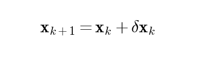

where the update step $\delta \mathbf{x}_k$ is:

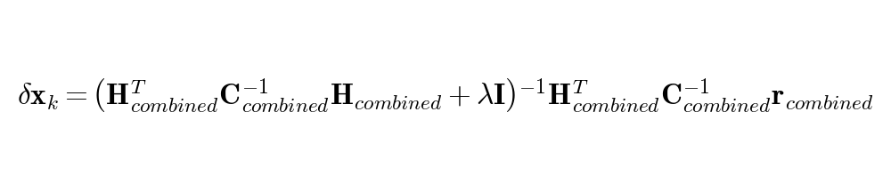

with:
* The combined Jacobian matrix:
  
  

* The block-diagonal combined covariance:
  
  

* The residual vector:
  
  %20\\%20\tilde{\boldsymbol{\phi}}%20-%20\boldsymbol{\phi}(\mathbf{x}_k)%20\end{bmatrix})
  
- $\lambda$ is the regularization parameter for numerical stability

## Cramer-Rao Lower Bound (CRLB) Analysis

The CRLB provides the theoretical lower bound on the covariance matrix of any unbiased estimator:

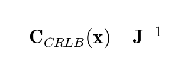

where $\mathbf{J}$ is the Fisher Information Matrix (FIM):

### Doppler-only FIM

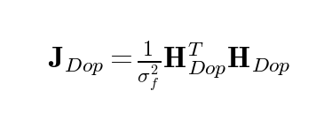

### AoA-only FIM

### Combined FIM

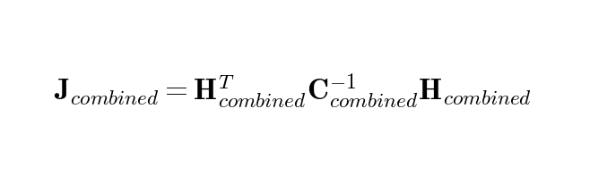

The CRLB trace is used as a scalar measure of estimation uncertainty:

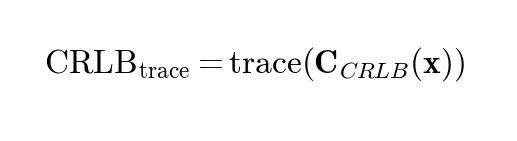

## Platform Trajectory Model

The platform trajectory is generated using the weave model, which provides position and velocity as functions of time. The motion is characterized by alternating turns with specified g-force.

The turn angle is modeled as:

where:
- $\theta_{max}$ is the maximum turn angle (30 degrees)
- $v_{horiz}$ is the horizontal velocity
- $r_{turn} = \frac{v_{horiz}^2}{a_{horiz}}$ is the turn radius
- $a_{horiz} = g \cdot 9.81$ m/s² is the horizontal acceleration

The platform velocities are computed as:

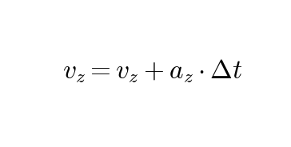

where $a_z$ alternates between positive and negative values to create vertical oscillation.

## Monte Carlo Simulation

The Monte Carlo simulation generates multiple realizations of noisy measurements and applies the estimator to each:

The RMS error is calculated as:

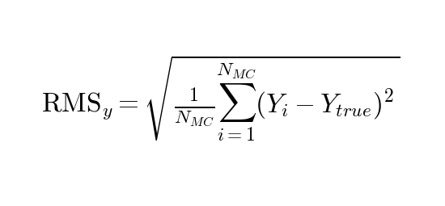

## Improvement Ratio Calculation

The improvement ratio of the combined method over Doppler-only is:

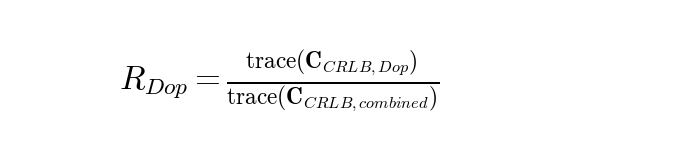

The improvement ratio over AoA-only is:

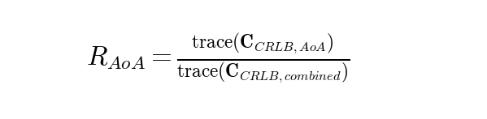

## Results

### Emitter Location Estimation

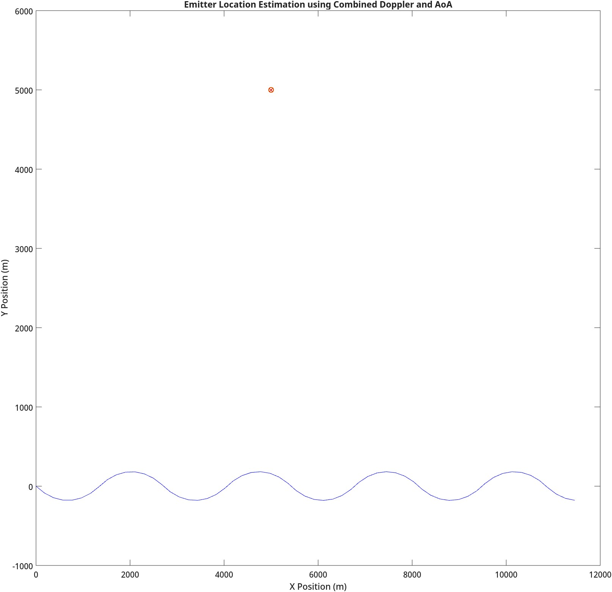

### Error Analysis

### Method Comparison

### Trajectory Analysis

### Measurement Quality Impact

## Key Findings

1. **Position Estimation Accuracy**:
   - Doppler-only: 3D RMS error = 9.18 m
   - AoA-only: 3D RMS error = 1.29 m
   - Combined: 3D RMS error = 1.05 m

2. **CRLB Analysis**:
   - Doppler-only: $\text{trace}(\mathbf{C}_{CRLB,Dop}) = 8.47 \times 10^1$
   - AoA-only: $\text{trace}(\mathbf{C}_{CRLB,AoA}) = 1.64 \times 10^0$
   - Combined: $\text{trace}(\mathbf{C}_{CRLB,combined}) = 1.13 \times 10^0$

3. **Improvement Ratios**:
   - Over Doppler-only: $R_{Dop} = 75.05$
   - Over AoA-only: $R_{AoA} = 1.45$

4. **Trajectory Impact**:
   - 1.0g: $R_{Dop} = 103.64$, $R_{AoA} = 2.04$
   - 2.0g: $R_{Dop} = 81.36$, $R_{AoA} = 1.58$
   - 3.0g: $R_{Dop} = 75.05$, $R_{AoA} = 1.45$
   - 4.0g: $R_{Dop} = 74.63$, $R_{AoA} = 1.44$

5. **Measurement Quality Impact**:
   - Optimal improvement (2.46×) occurs at $\sigma_f = 3.16$ Hz, $\sigma_\phi = 10.00$ degrees
   - Improvement ratio varies systematically with measurement quality, following a pattern where the combined method provides greatest advantage when compensating for poor quality in one measurement type

## References

[1] N. O'Donoughue, Emitter Detection and Geolocation for Electronic Warfare, ser. Artech House electronic warfare library. Artech House, 2019. [Online]. Available: https://books.google.com/books?id=TbjEDwAAQBAJ

[2] S. Frattasi and F. Rosa, Mobile Positioning and Tracking: From Conventional to Cooperative Techniques, ser. IEEE Press. Wiley, 2017. [Online]. Available: https://books.google.com/books?id=rvImDwAAQBAJ

[3] R. G. Stansfield, "Statistical theory of d.f. fixing," Journal of the Institution of Electrical Engineers - Part IIIA: Radiocommunication, vol. 94, no. 15, pp. 762–770, April 1947.

[4] D. J. Torrieri, "Statistical theory of passive location systems," IEEE Transactions on Aerospace and Electronic Systems, vol. AES-20, pp. 183–198, 1984. [Online]. Available: https://api.semanticscholar.org/CorpusID:8983806

[5] K. Becker, "An efficient method of passive emitter location," IEEE Transactions on Aerospace Electronic Systems, vol. 28, no. 4, pp. 1091–1104, Oct. 1992.

[6] J. Foutz, A. Spanias, and M. Banavar, Narrowband Direction of Arrival Estimation for Antenna Arrays, 01 2008, vol. 3.

[7] M. Fowler, "Eece 522 estimation theory lecture notes," http://www.ws.binghamton.edu/fowler/fowler%20personal%20page/EE522.htm, Jan. 29 2014.

[8] M. Khalaf-Allah, "Emitter location with azimuth and elevation measurements using a single aerial platform for electronic support missions," Sensors, vol. 21, no. 12, 2021. [Online]. Available: https://www.mdpi.com/1424-8220/21/12/3946

[9] Fundamentals of Statistical Signal Processing, Volume 1: Estimation Theory. Pearson Education. [Online]. Available: https://books.google.com/books?id=pDnV5qf1f6IC

[10] E. J. Bailey, "Single platform geolocation of radio frequency emitters," Air Force Institute of Technology, 2015. [Online]. Available: https://scholar.afit.edu/etd/22

[11] M. Fowler, "Analysis of single-platform passive emitter location with terrain data," IEEE Transactions on Aerospace and Electronic Systems, vol. 37, no. 2, pp. 495–507, 2001.

