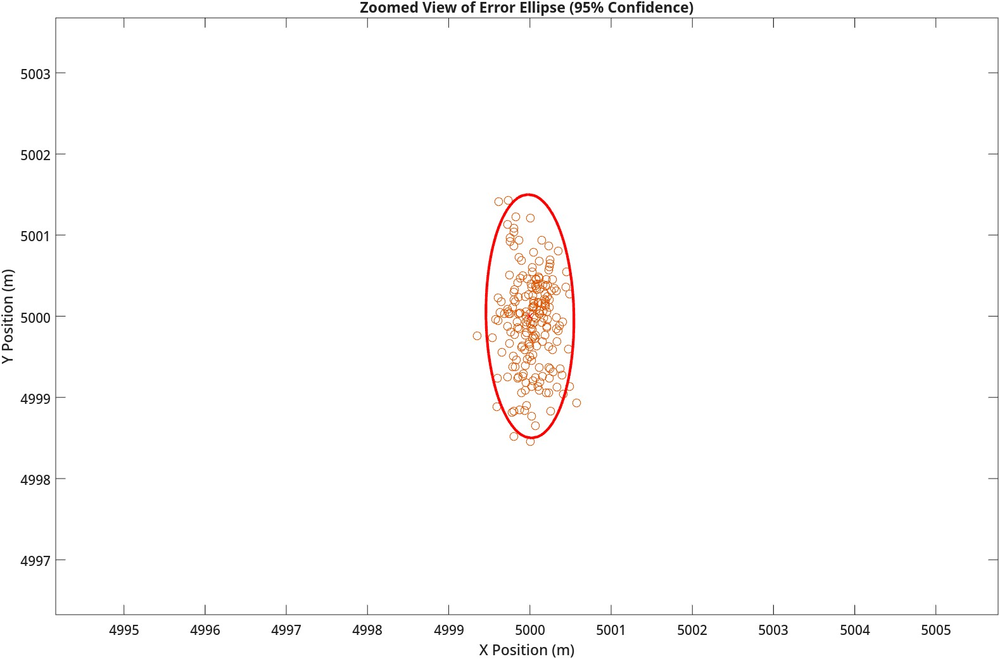
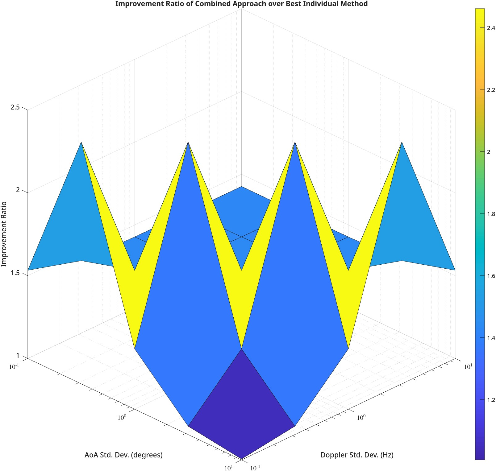

# Combined Doppler and AoA Emitter Location

MATLAB implementation and analysis of Combined Doppler and Angle-of-Arrival (AoA) methods for passive emitter location.

## Mathematical Models

### Doppler Measurement Model

The Doppler frequency shift measurement model is given by:

$$f(t, \mathbf{x}) = f_c - \frac{f_c}{c} \frac{\mathbf{V}(t) \cdot (\mathbf{P}(t) - \mathbf{X})}{\|\mathbf{P}(t) - \mathbf{X}\|}$$

where:
- $\mathbf{x} = [X, Y, Z, f_c]^T$ is the parameter vector
- $f_c$ is the carrier frequency
- $\mathbf{P}(t) = [X_p(t), Y_p(t), Z_p(t)]^T$ is the platform position
- $\mathbf{V}(t) = [V_x(t), V_y(t), V_z(t)]^T$ is the platform velocity
- $\mathbf{X} = [X, Y, Z]^T$ is the emitter position
- $c$ is the speed of light

### Angle-of-Arrival Measurement Model

The AoA phase measurement model is given by:

$$\phi(t_i) = \phi_0 - \frac{2\pi}{\lambda} \frac{\mathbf{L}(t_i) \cdot (\mathbf{P}(t_i) - \mathbf{X})}{\|\mathbf{P}(t_i) - \mathbf{X}\|}$$

where:
- $\phi_0$ is the phase offset
- $\lambda = \frac{c}{f_c}$ is the wavelength
- $\mathbf{L}(t_i)$ is the scaled baseline vector at time $t_i$

## Jacobian Matrices

### Doppler Jacobian

$$\mathbf{H}_{Dop} = \begin{bmatrix} \frac{\partial f}{\partial X} & \frac{\partial f}{\partial Y} & \frac{\partial f}{\partial Z} & \frac{\partial f}{\partial f_c} \end{bmatrix}$$

### AoA Jacobian

$$\mathbf{H}_{AoA} = \begin{bmatrix} \frac{\partial \phi}{\partial X} & \frac{\partial \phi}{\partial Y} & \frac{\partial \phi}{\partial Z} & \frac{\partial \phi}{\partial \phi_0} \end{bmatrix}$$

## Combined Nonlinear Least Squares Estimator

The combined estimator minimizes:

$$\hat{\mathbf{x}} = \arg\min_{\mathbf{x}} \left[ (\tilde{\mathbf{f}} - \mathbf{f}(\mathbf{x}))^T \mathbf{C}_f^{-1} (\tilde{\mathbf{f}} - \mathbf{f}(\mathbf{x})) + (\tilde{\boldsymbol{\phi}} - \boldsymbol{\phi}(\mathbf{x}))^T \mathbf{C}_\phi^{-1} (\tilde{\boldsymbol{\phi}} - \boldsymbol{\phi}(\mathbf{x})) \right]$$

## Cramer-Rao Lower Bound (CRLB) Analysis

The CRLB provides the theoretical lower bound on the covariance matrix of any unbiased estimator:

$$\mathbf{C}_{CRLB}(\mathbf{x}) = \mathbf{J}^{-1}$$

where $\mathbf{J}$ is the Fisher Information Matrix (FIM).

## Results

### Emitter Location Estimation

### Error Analysis

### Method Comparison

### Trajectory Analysis

### Measurement Quality Impact

## Key Findings (10,000 Monte Carlo Simulation runs)

1. **Position Estimation Accuracy**:
   - Doppler-only: 3D RMS error = 9.17m
   - AoA-only: 3D RMS error = 2.55m
   - Combined: 3D RMS error = 2.30m

2. **CRLB Analysis**:
   - Doppler-only: $\text{trace}(\mathbf{C}_{CRLB,Dop}) = 8.47 \times 10^1$
   - AoA-only: $\text{trace}(\mathbf{C}_{CRLB,AoA}) = 1.64 \times 10^0$
   - Combined: $\text{trace}(\mathbf{C}_{CRLB,combined}) = 1.13 \times 10^0$

3. **Improvement Ratios**:
   - Over Doppler-only: $R_{Dop} = 75.05$
   - Over AoA-only: $R_{AoA} = 1.45$

4. **Trajectory Impact**:
   - 1.0g: $R_{Dop} = 103.64$, $R_{AoA} = 2.04$
   - 2.0g: $R_{Dop} = 81.36$, $R_{AoA} = 1.58$
   - 3.0g: $R_{Dop} = 75.05$, $R_{AoA} = 1.45$
   - 4.0g: $R_{Dop} = 74.63$, $R_{AoA} = 1.44$

5. **Measurement Quality Impact**:
   - Optimal improvement (2.46×) occurs at $\sigma_f = 3.16$ Hz, $\sigma_\phi = 10.00$ degrees
